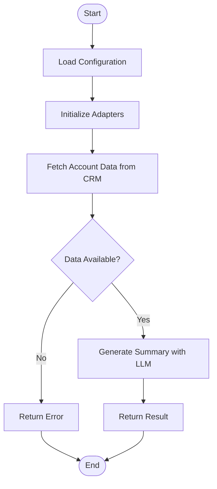

# Email Summary Agent

## Description
The Email Summary Agent generates concise, professional summaries of sales accounts for use in outreach emails. It fetches account data from a CRM system and uses an LLM to create targeted email content.

## API Usage
```python
# Initialize the agent
agent = Agent("path/to/config.json")

# Run with default account ID from config
result = agent.run({})

# Run with specific account ID
result = agent.run({"account_id": "acc-5678"})
```

## Flow Diagram


## Adapters Used
- CRM Adapter: Salesforce
- LLM Adapter: OpenAI

## Configuration Options
- `llm_model`: The LLM model to use (default: "gpt-4")
- `temperature`: The creativity level for the LLM (default: 0.5)
- `default_account_id`: The default account ID to use if none is provided
- `prompt_file`: The prompt template file to use
- `prompt_version`: The version of the prompt to use (default: "latest")

## Prompt Versioning
This agent uses semantic versioning for its prompts:
- email_prompt/v1.0.0: Initial prompt
- email_prompt/v1.1.0: Improved summary guidelines
- email_prompt/v2.0.0: Major revision with more specific instructions